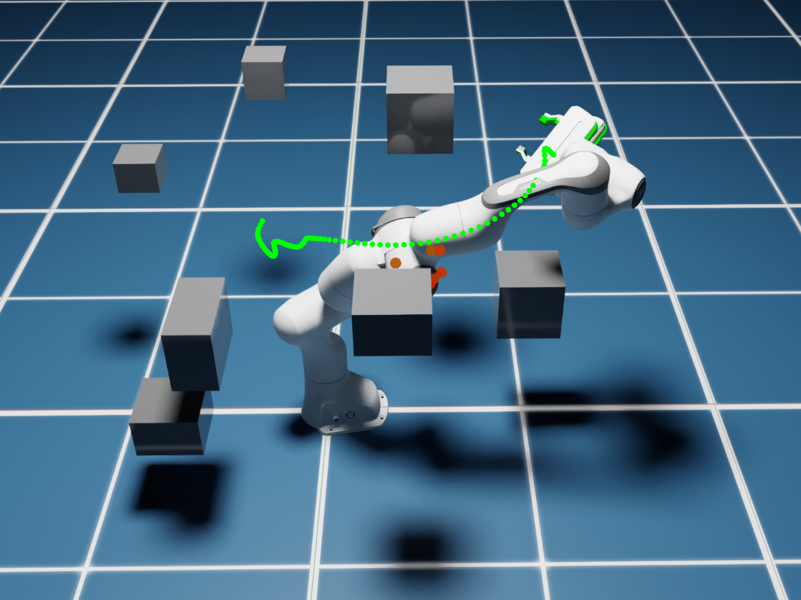
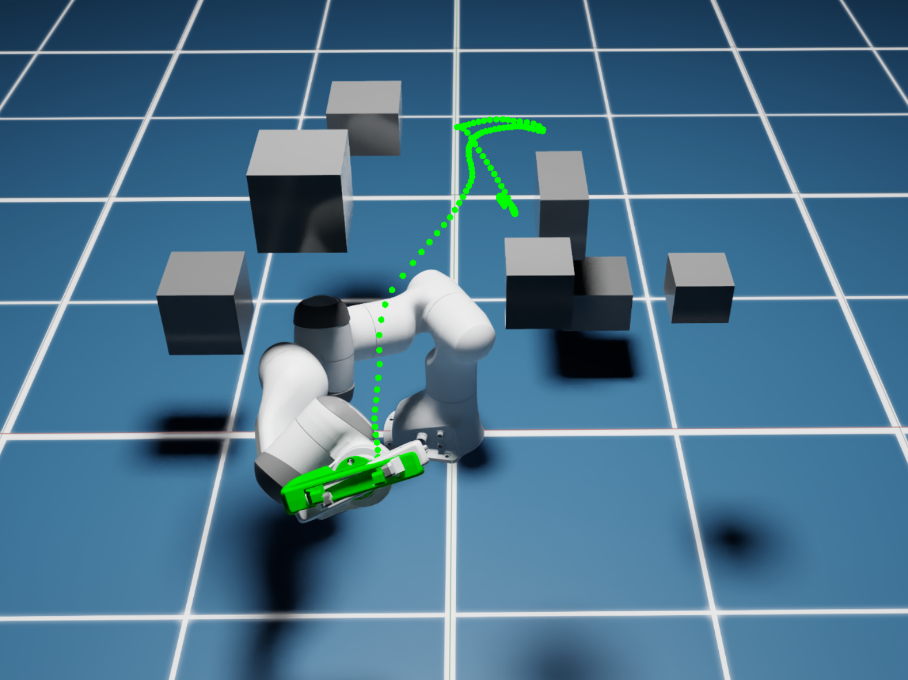
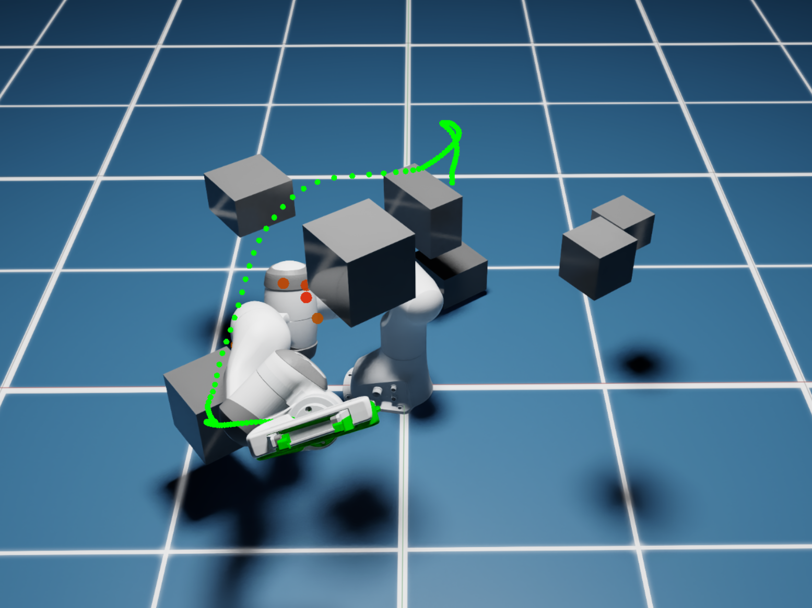
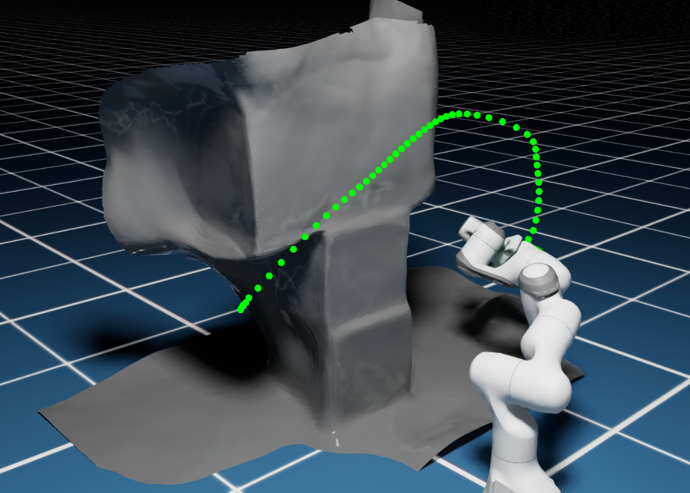
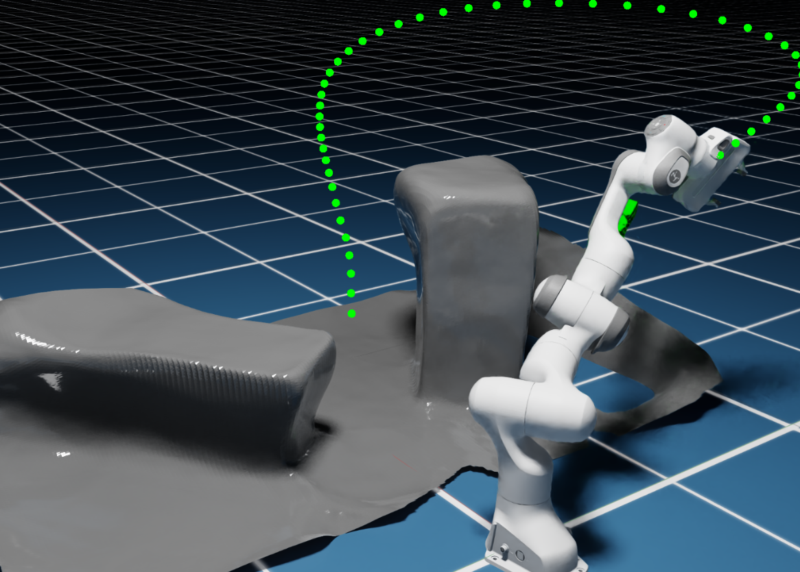
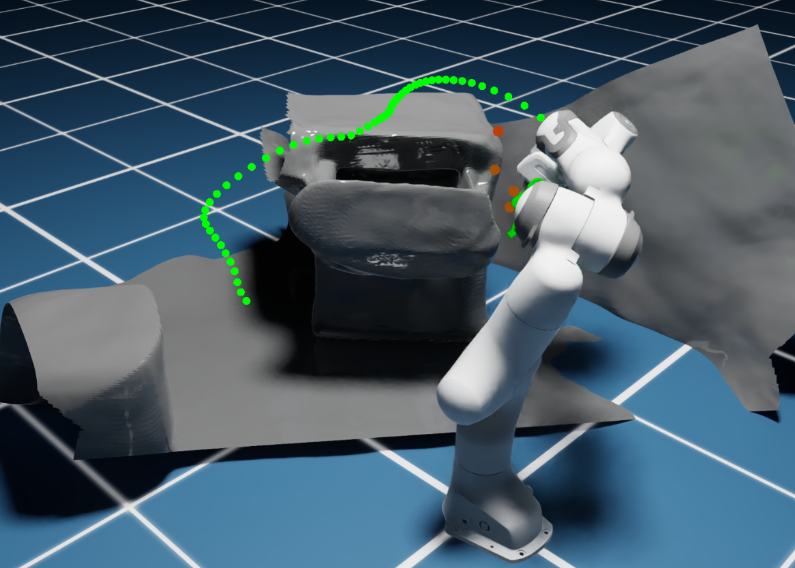
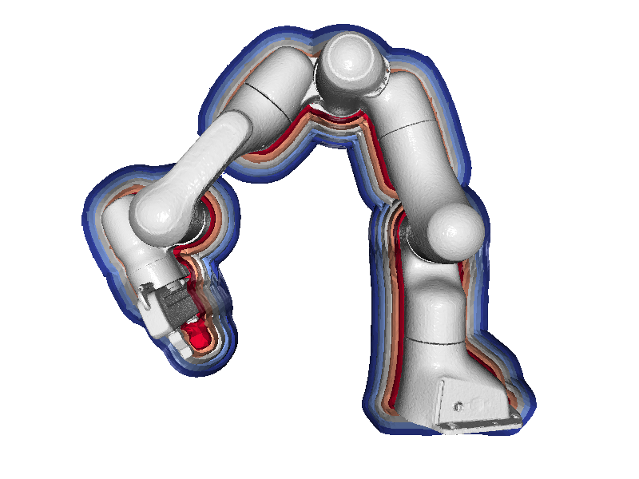

# Code for paper "SAMP: Spatial Anchor-based Motion Policy for Collision-Aware Robotic Manipulators"


<a href="https://arxiv.org/abs/2509.11185"></a>


<p align="center">
<table>
  <tr>
    <td align="center"><br></td>
    <td align="center"><br></td>
    <td align="center"><br></td>
  </tr>
  <tr>
    <td align="center"><br></td>
    <td align="center"><br></td>
    <td align="center"><br></td>
  </tr>
</table>
</p>

## Dependencies

- python: 3.10.14
- torch: 2.2.2 + cu118
- Issac sim: 4.1.0
- cuRobo: 0.7.6
- open3d: 0.19.0
- robofin: 0.0.1

### Option 1: Standard installation
```bash
pip install -r requirements.txt
```

### Option 2: Manual installation (for slow networks)
```bash
# Install basic packages
pip install mesh-to-sdf==0.0.15 trimesh==4.5.3 open3d==0.19.0 h5py==3.14.0 scikit-image==0.25.0 matplotlib==3.8.4

# Download and install robofin manually
wget https://github.com/fishbotics/robofin/archive/v0.0.1.tar.gz
tar -xzf v0.0.1.tar.gz
cd robofin-0.0.1 && pip install -e . && cd ..

# Download and install pointnet2_ops manually  
wget https://github.com/fishbotics/pointnet2_ops/archive/main.tar.gz
tar -xzf main.tar.gz
cd pointnet2_ops-main && pip install -e . && cd ..
```

**Note:** The `omni_python` command below refers to a system alias that points to the python.sh script in the Isaac Sim installation directory. For example, in our environment, we configured it following the official tutorial as: `alias omni_python='~/.local/share/ov/pkg/isaac-sim-4.1.0/python.sh'`. Besides version 4.1, we have also successfully tested on Isaac Sim 5.0. 

For [cuRobo](https://curobo.org/get_started/1_install_instructions.html) installation, please refer to the official documentation.

## Usage

### Generate dataset for training Robot SDF

First, we need to generate a dataset for learning the robot SDF. This implementation follows the [RDF](https://github.com/idiap/RDF/tree/main) approach, using the [mesh_to_sdf](https://github.com/marian42/mesh_to_sdf) to sample SDF values.


```python
omni_python sample_sdf_point.py
```

### Train the robot SDF model

Next, we use the collected dataset to train the model with a default setting of 5000 epochs, which takes several minutes to complete. After training, the model will be used to sample robot points and generate meshes for visualization purposes.


```python
omni_python encode_panda_sdf_points_sampler.py
```



### Collect expert trajectories

We use cuRobo to generate feasible trajectories in diverse environments and collect the corresponding SDF information for direct loading during training. 

Place the environment configuration files from the scenes folder into `/PATH_TO_CUROBO/src/curobo/content/configs/world`, then load different environments by switching the environment parameter file, the code if the file is `world_file = "dataset_generation_scene_1.yml"`.


```python
omni_python traj_data_collect.py
```

After collecting data from all environments, merge the data into a single file for convenient access. You can modify the environment IDs to be merged in the `target_env_list` variable, which will affect which data is used during training.


```python
omni_python process_dataset_diverse_env.py
```

Train the model with configurable anchor points size parameters.

```python
omni_python main_train.py
```

Test performance in different environments. You can modify the scene `world_file = "dataset_generation_scene_1.yml"` and the trajectory test dataset `./isaac_sim_traj/dataset0001.pkl`.


```python
omni_python eval_policy_results.py
```

## Citation

```
@misc{chen2025sampspatialanchorbasedmotion,
      title={SAMP: Spatial Anchor-based Motion Policy for Collision-Aware Robotic Manipulators}, 
      author={Kai Chen and Zhihai Bi and Guoyang Zhao and Chunxin Zheng and Yulin Li and Hang Zhao and Jun Ma},
      year={2025},
      eprint={2509.11185},
      archivePrefix={arXiv},
}
```

## Thanks

- [RDF](https://github.com/idiap/RDF/tree/main)
- [ObjectSDF++](https://github.com/QianyiWu/objectsdf_plus)
- [Motion Policy Network](https://github.com/NVlabs/motion-policy-networks)
